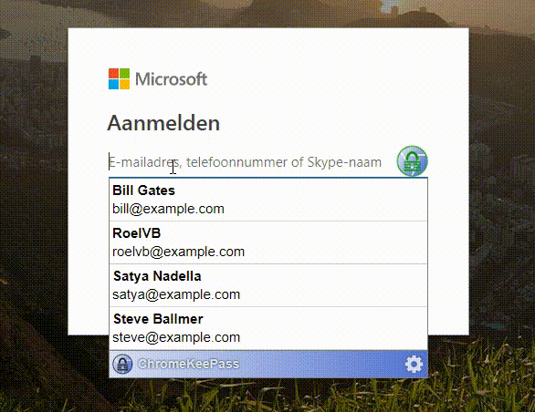
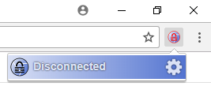
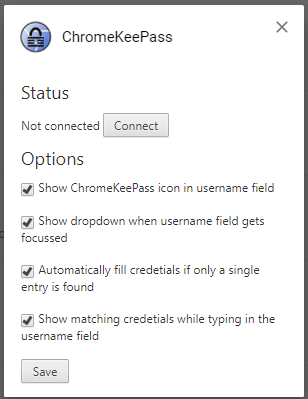
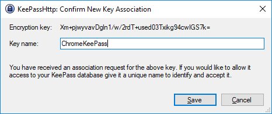

# ChromeKeePass

ChromeKeePass is an open source Chrome extension to automatically fill credentials into websites.

The extension depends on [KeePassHttp](https://github.com/pfn/keepasshttp), with this KeePass plugin we'll get a secure communication between the browserextension and KeePass.

The goal of this project is to create a userfriendly KeePass integration. With an easily readable and understandable sourcecode.

## Setup

1. Make sure you have KeePassHttp installed. Instruction on [how to install](Documents/Manuals/KeePassHttp%20installation.md) KeePassHttp.

2. Make sure KeePass is running and a password database is opened

3. Click the ChromeKeePass icon next to the addressbar, it'll show 'Disconnected', click the gear to go to the options

   

4. The ChromeKeePass options open, click the `Connect` button

   

5. A KeePass dialog will open, enter a desired name and click `Save`

   

6. The ChromeKeePass options dialog will now show it is connected

   

7. The encryption key (for secure communication between KeePass en ChromeKeePass) is stored insite your KeePass database under the entry 'KeePassHttp Settings'